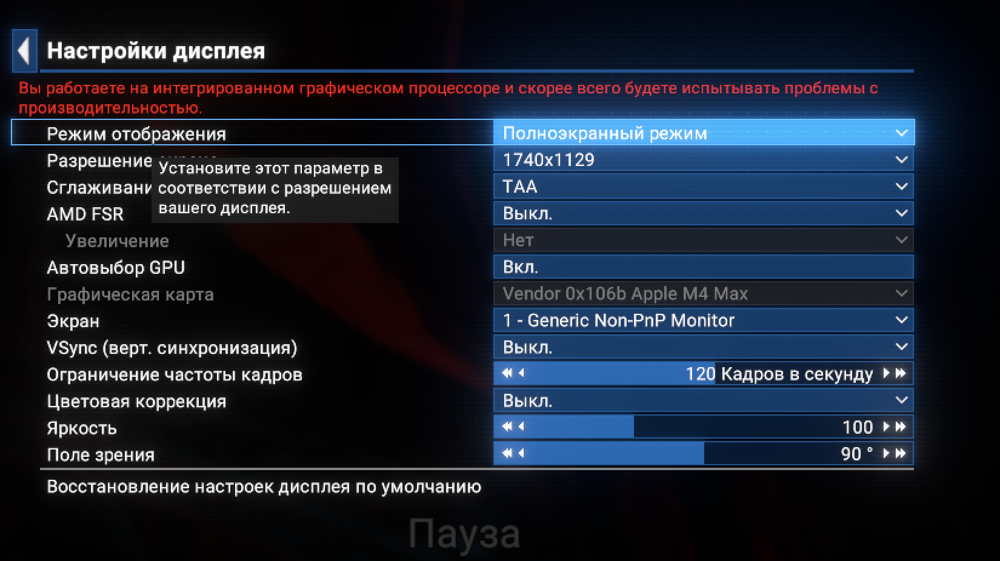
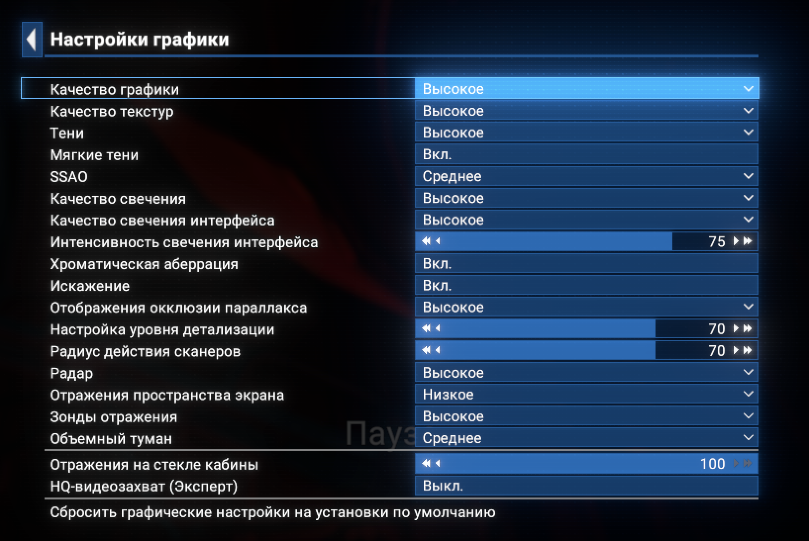

# Производительность и настройки

## Результат на нашем Mac

10 сентября 2026 года. MacBook Pro 16 дюймов, M4 Max: 16 ядер CPU, 40 ядер GPU, 48 ГБ общей памяти. macOS 26.3.1 (a), CrossOver 26.2, MoltenVK 1.4.1 privateapi. X4 из Steam, build 23660954. Бутылка 64 бит, MSync включён, графический режим Auto. Полный список DLC и модов и инструментальные замеры не записаны.

По отчёту владельца, артефактов и сильных фризов нет. В очень развитом сохранении с мегастанциями, тысячами кораблей игрока и фракций плавность субъективно соответствует примерно 45 до 60 FPS. В раннем сохранении с меньшим числом объектов ощущается около 100 FPS и выше. **Это субъективные оценки. Счётчик Steam показывал чёрное поле.** Первые скриншоты демонстрируют карту, более поздний подтверждает внешний вид в полёте, поэтому результат нельзя автоматически переносить на каждый бой, кабину или интерьер станции. Количество кораблей и сходное падение производительности на мощном ПК указаны со слов владельца.

В меню и конфигурации выбрано **1740×1129**, физическая матрица имеет **3456×2234** пикселя. Размер снимка экрана и масштаб Retina не доказывают размер кадрового буфера игры. Результат при полном разрешении матрицы пока не установлен. [Описание режима высокого разрешения CrossOver](https://support.codeweavers.com/en_US/crossover-mac-user-guide).

В конфигурации также хранится `gamespeed=0.5`. По одному значению нельзя установить, был ли активен режим замедления во время игры. При следующих тестах нужно отдельно записать реальную скорость симуляции. Egosoft добавила [Reduced Speed Mode в специальные возможности](https://wiki.egosoft.com/X4%20Foundations%20Wiki/Game%20Updates%20and%20Patch%20History/X4%20Foundations%207.xx%20Changelogs/).

На снимках мониторинга X4 занимает около 11,91 ГБ памяти. Во всей системе занято около 39,99 ГБ, давление памяти зелёное, своп равен нулю. Это отдельные снимки, а не максимальное потребление. Свободный процент всего CPU не исключает ограничения одним занятым потоком симуляции.

## Проверенные настройки

Полный экран 1740×1129. TAA. FSR и генерация кадров выключены. VSync выключен, ограничение 120 кадров, FOV 90°.

| Параметр | Значение |
|---|---|
| Пресет, текстуры, тени | Высокое |
| Мягкие тени | Включены |
| SSAO | Среднее |
| Свечение и свечение интерфейса | Высокое, интенсивность интерфейса 75 |
| Хроматическая аберрация и искажение | Включены |
| Окклюзия параллакса | Высокое |
| Детализация и дальность эффектов | 70 и 70 |
| Радар | Высокое |
| Отражения пространства экрана | Низкое |
| Зонды отражения | Высокое |
| Объёмный туман | Среднее |
| Отражения на стекле кабины | 100 |
| HQ видеозахват | Выключен |
| Плотность персонажей и трафика в конфигурации | 0.50 и 0.50 |

Настройки выбираются через меню. Лаунчер не заменяет ваш config.xml.

## Предварительные рекомендации

Проверенного минимального Mac пока нет. Эти профили нужны для первого теста на имеющемся компьютере, а не для обещания конкретного FPS перед покупкой.

| Задача | Ориентир по Mac | Разрешение и настройки | Статус |
|---|---|---|---|
| Осторожный начальный профиль | M4 Pro, 24 ГБ, активное охлаждение | Около 1080p, Medium, TAA, тени Medium, SSAO и туман Low, LOD 50 | Предложение для теста |
| Повторить наш результат | M4 Max 16 CPU / 40 GPU, 48 ГБ | 1740×1129, настройки выше | Стабильность подтверждена пользователем, FPS субъективный |
| Большая империя и флоты | Сильный CPU, желательно 36 до 48 ГБ памяти или больше | Начать около 1080p со средних настроек | Запас памяти полезен, FPS не гарантирован |
| Более чёткая картинка | M4 Max, 48 ГБ | Попробовать 2560×1440 или 2560×1600, Medium/High | На этих разрешениях не проверено |
| Полная Retina или 4K | Подтверждённого минимума нет | Отдельный тест, начать со средних, при необходимости FSR Quality | Замеров нет |
| Старые или базовые M, 8 ГБ | Подтверждённого минимума нет | Экспериментальный запуск | Комфорт не подтверждён |

[Автор исходного исправления](https://www.codeweavers.com/support/forums/general/?t=27;msg=346291#c6) сообщил о запуске на M4 Pro, но не предоставил FPS. [Требования X4 в Steam](https://store.steampowered.com/app/392160/X4_Foundations/) относятся к поддерживаемым системам и не являются готовым сравнением с Mac.

Для установки оставьте хотя бы 5 ГБ сверх уже установленной игры и обычного запаса macOS. Копия CrossOver занимает около 1 ГБ. У нас игра занимает около 32 ГБ, другой набор DLC может отличаться.

## Как получить достоверный замер

Подключите питание. Запишите режим энергопотребления и дайте компьютеру прогреться. Используйте одно сохранение, одинаковую непоставленную на паузу сцену, камеру и скорость симуляции. Отключите SETA, отдельно укажите режим замедления. Выполните три прохода по 60 секунд после завершения загрузки.

Карту, полёт, бой и станцию проверяйте отдельно. Для комфортного профиля можно выбрать устойчивый порог 30 FPS или цель 60 FPS. Это критерий теста, а не обещанный результат.

Нужен работающий счётчик или захват времени кадра. Опция Metal HUD в лаунчере экспериментальная, её показания можно использовать лишь после проверки, что оверлей реально работает. Без измерителя лучше описать плавность и фризы словами. Не вычисляйте FPS из процентов CPU и GPU. По возможности сохраните средний FPS и 99 й процентиль времени кадра. Подробные отладочные логи при замерах отключайте.

Если снижение разрешения заметно помогает, уменьшайте графическую нагрузку, особенно тени, SSAO и туман. Если почти не помогает, возможное ограничение находится в симуляции. Крупное сохранение способно нагрузить и мощный ПК. Лаунчер не переписывает движок симуляции.
