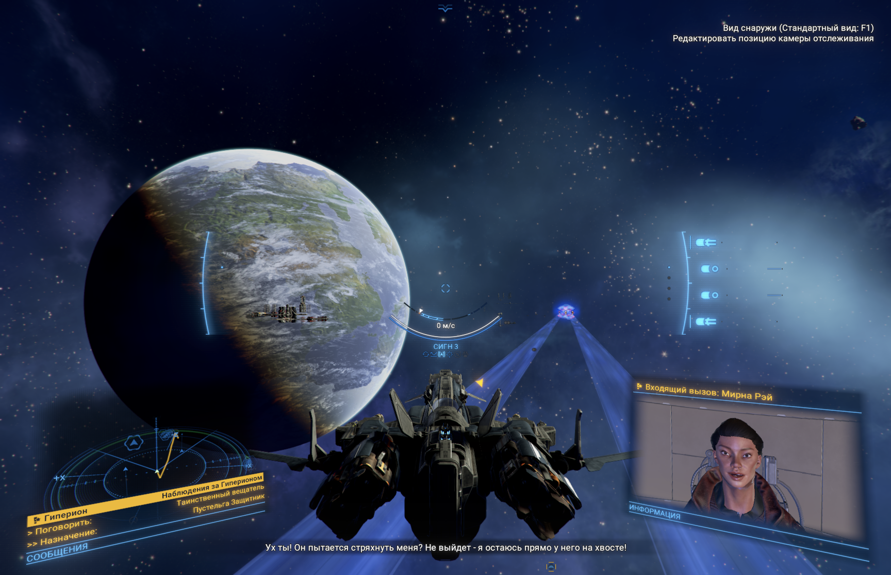

# Validation record

10 September 2026, release 0.1.0.

## Completed

1. The official MoltenVK 1.4.1 privateapi archive was downloaded and its SHA256 matched both the release metadata and the installer's pin.
2. A native feature probe running as x86_64 on the M4 Max reported `logicOp=0` with the original CrossOver library and `logicOp=1` with the replacement.
3. X4 was launched via the copied CrossOver runtime. The player confirmed stable gameplay, no visible artifacts and no major freezes in early and heavily developed saves. A later screenshot also shows an external flight view. There is no instrumented FPS result.
4. The packaged installer was run against the real CrossOver 26.2 installation using a separate validation destination. The installed library hash, managed marker and strict bundle signature were checked. The original library hash remained unchanged.
5. The automatic entry script installed a managed copy, then launched Steam with the X4 launch request. The initial graceful Steam shutdown test exposed a wait that was too short; the wait was extended to 45 seconds. No force kill is used.
6. Fourteen isolated workflow tests pass on macOS. They cover checksum rejection, signing failure cleanup, original preservation, duplicate installs, symlink/path rejection, unknown destinations, version gating, active game preservation, bottle ambiguity, incomplete downloads, 32 bit bottles and runtime conflicts.
7. The Swift desktop application builds for Apple Silicon, passes its resource self test and strict code signature verification. The ZIP contains the app and bundled scripts, without game or vendor binaries.

## Limits

The application's visual layout has not been inspected through automated screen capture because that connection was unavailable. A clean account download and its first Gatekeeper approval need independent user testing. The build is locally signed and not notarized. No claim of automatic macOS approval is made.

The installer works in the local Applications folder. A separate test in a Documents folder managed by a File Provider failed signature verification because Finder metadata was restored on the bundle. This failed install cleaned its staging folder and did not publish a destination. Application builds now use the macOS temporary directory, and installation defaults to the local Applications folder.

Only the reported M4 Max configuration has gameplay evidence from this project. Different Macs, operating systems, CrossOver versions and X4 builds require their own reports. The optional Metal HUD has not been proven to display valid FPS in this environment.

No game save or private diagnostic log is included in the repository.

